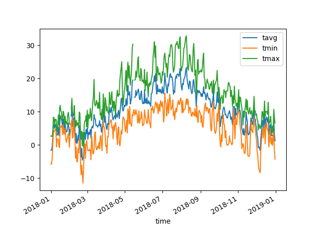

# Meteostat Python Package
The Meteostat Python library provides a simple API for accessing open weather and climate data. The historical observations and statistics are collected by the [Meteostat project](https://meteostat.net/en) from different public interfaces, most of which are governmental. Among the data sources are national weather services like the National Oceanic and Atmospheric Administration (NOAA) and Germany's national meteorological service (DWD).

## Installation
The Meteostat Python package is available through PyPI:
```
pip install
```

## Synopsis
The Meteostat Python library is divided into multiple classes which provide access to the actual data:
* Stations: Query weather stations
* Daily: Access daily aggregated weather data
* Hourly: Access hourly observations

Let's pretend you want to plot temperature data for Vancouver, BC from 2018:
```python
# Import Meteostat library and dependencies
from meteostat import Stations, Daily
from datetime import datetime
import matplotlib.pyplot as plt

# Get closest weather station to Vancouver, BC
stations = Stations(lat = 49.2497, lon = -123.1193)
station = stations.fetch(1)

# Get daily data for 2018 at the selected weather station
data = Daily(station, start = datetime(2018, 1, 1), end = datetime(2018, 12, 31))
data = data.fetch()

# Plot line chart including average, minimum and maximum temperature
data.plot(x = 'time', y = ['tavg', 'tmin', 'tmax'], kind = 'line')
plt.show()
```
Take a look at the expected output:


## License
Meteorological data is provided under the terms of the [Creative Commons Attribution-NonCommercial 4.0 International Public License](https://creativecommons.org/licenses/by-nc/4.0/legalcode). Also, please be aware that Meteostat uses data which is shared under [WMO resolution 40](https://www.wmo.int/pages/prog/www/ois/Operational_Information/Publications/Congress/Cg_XII/res40_en.html).

The code of this library is available under the [MIT license](https://opensource.org/licenses/MIT).
